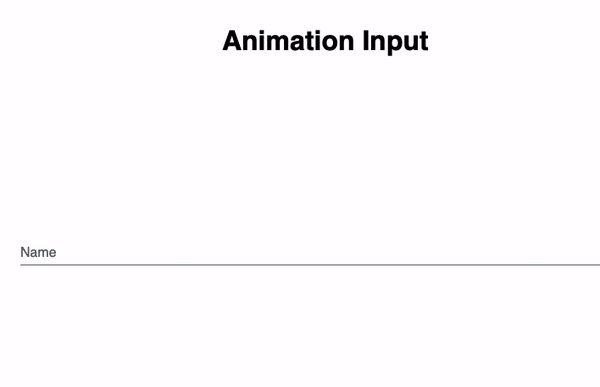

<h1 align="center">Welcome to Animation Input 🌱</h1>
<p>
  <a href="https://twitter.com/maisamaximo_" target="_blank">
    
  </a>
</p>

> Simple CSS animation input.

### 🏠 [Code Pen](https://codepen.io/maisamaximo/pen/eYYNQzK)




## Install

```sh
just run the index.html
```

## Author

💁 **Maisa Maximo**

* Twitter: [@maisamaximo_](https://twitter.com/maisamaximo_)
* Github: [@maisamaximo](https://github.com/maisamaximo)
* Linkedin: [Maisa Maximo](https://www.linkedin.com/in/maisa-maximo-ferreira/)

## Show your support

Give a ⭐️ if this project helped you!

***
```in code we trust```